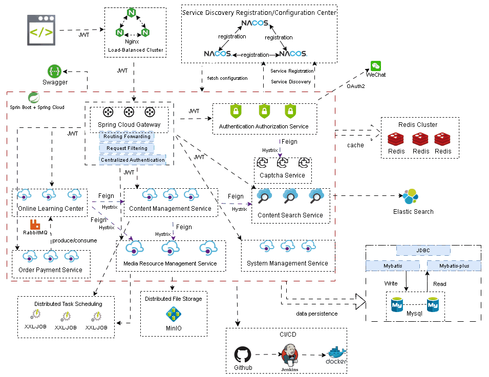
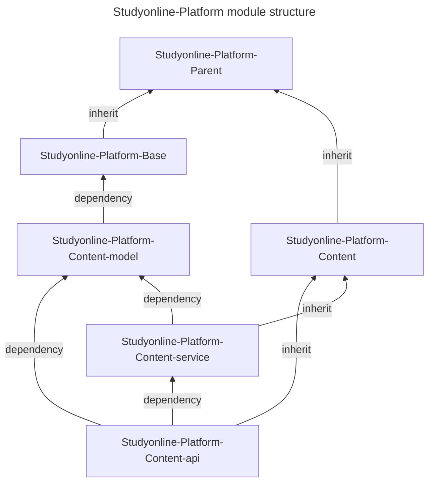

## Background
The project is based on the B2B2C business model, where educational institutions can join the platform, publish courses, and operational personnel can review the published courses. Only courses that pass the review can be successfully published. Users can choose courses for online learning, including both free and paid formats. For free courses, users can directly join the course list for learning, while for paid courses, successful payment is required before continuing with the learning process.

The backend architecture of this project is designed based on a distributed microservices framework to support high-concurrency and high-availability scenarios. 

 <a href="./resources/microservices.md">The included microservices</a> 

### System Architecture Diagram

### Module Structure

