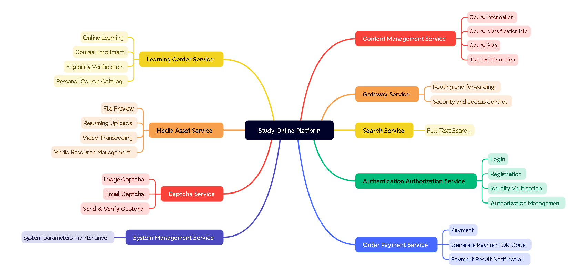

## Background

The project is based on the B2B2C business model, where educational institutions can join the platform, publish courses, sand operational personnel can review the published courses. Only courses that pass the review can be successfully published. Users can choose courses for online learning, including both free and paid formats. For free courses, users can directly join the course list for learning, while for paid courses, successful payment is required before continuing with the learning process.

The backend architecture of this project is designed based on a distributed microservices framework to support high-concurrency and high-availability scenarios. 

 <a href="./resources/microservices.md">The included microservices</a> 

### System Architecture Diagram

### Module Structure

**In the diagram, Content module is used as an example, and the same applies to other modules.**
Explanation: 

|       Name                   |Purpose   |
| --------------------------- | ---- |
| Studyonline-Platform-Parent | ￮Managing dependencies' versions ￮Serving as a Pom project, aggregating and managing sub-projects |
| Studyonline-Platform-Base | ￮Providing foundational libraries ￮Providing utility libraries ￮Inheriting from parent project |
| Studyonline-Platform-Content | responsible for aggregating content-api, content-service, and content-model. |
| Studyonline-Platform-Content-api | providing interfaces for the frontend. |
| Studyonline-Platform-Content-model | storing data model classes, data transfer types, etc. |
| Studyonline-Platform-Content-service | providing business logic support for the interface project. |

### Involved Technologies

